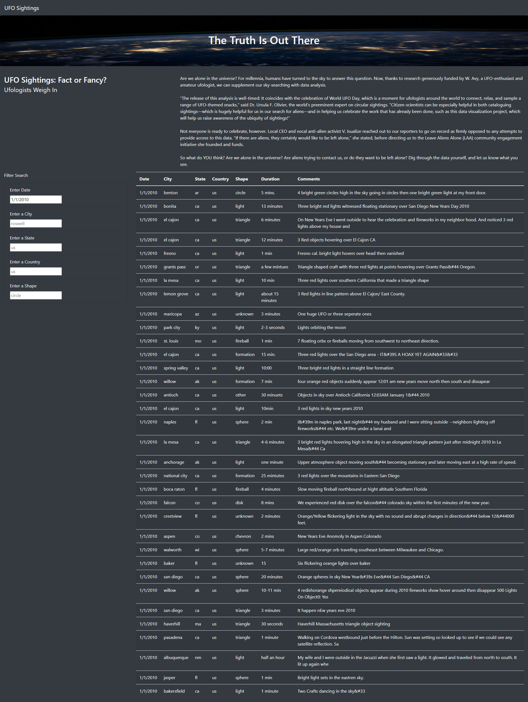
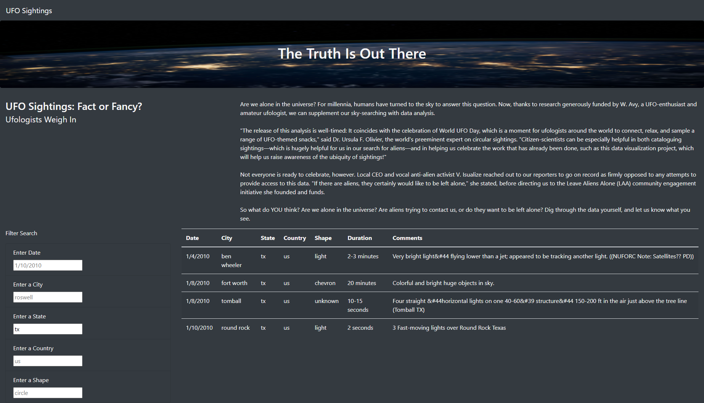
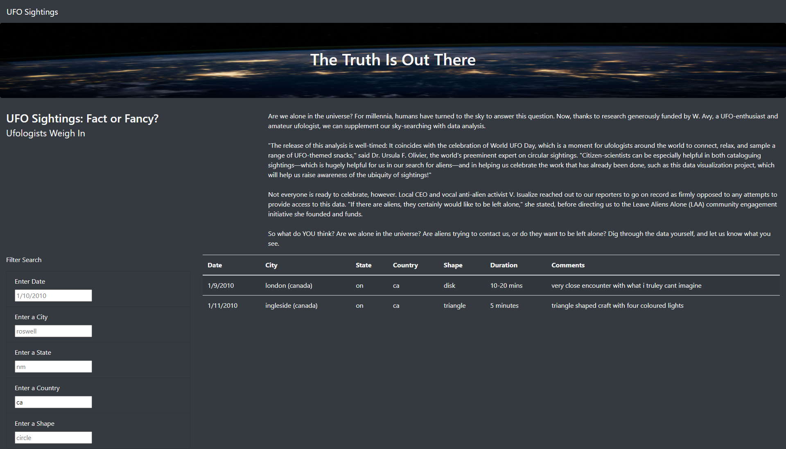
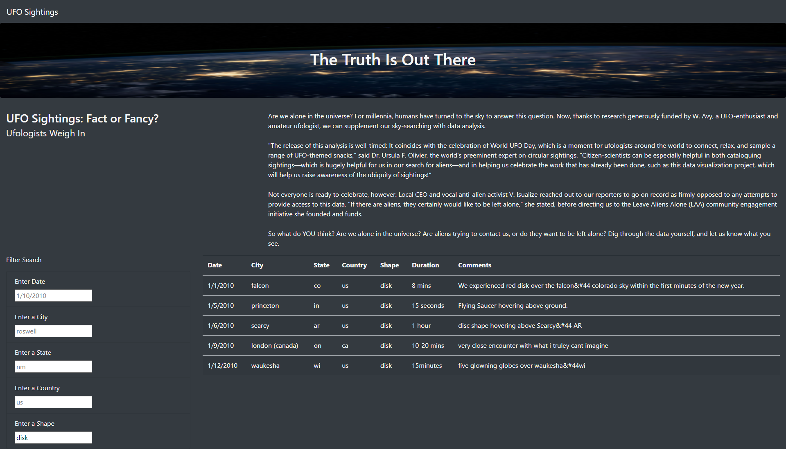
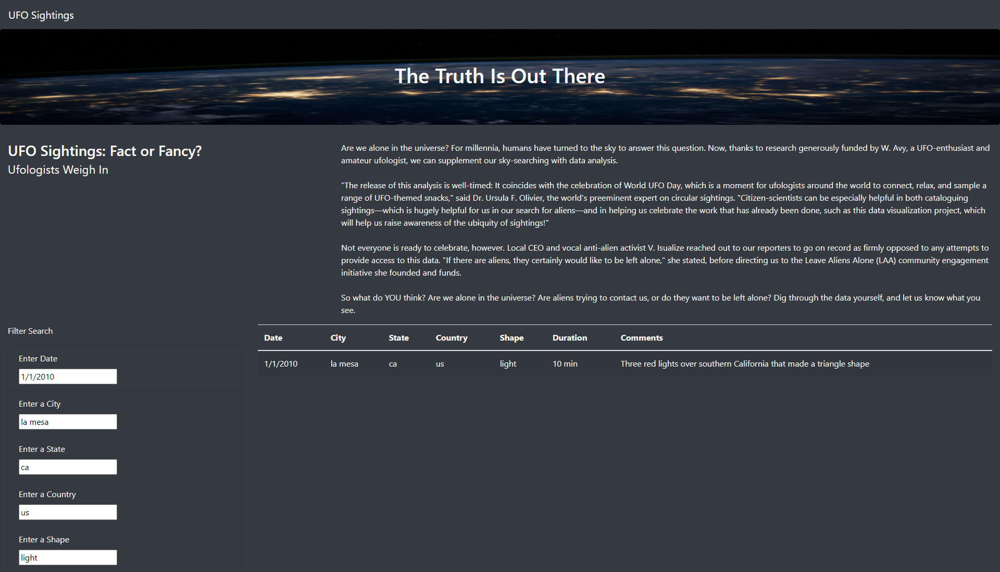

# UFOs

## Overview
To create a webpage that can effectively filtered a data-set by multiple parameters at the same time, and return an updated table-set based on those parameters. 

## Results
### Searching by Date
Input date into "Enter Date" box using M/D/YYYY format. If month or day value is a single digit, only include the single digit (ie: Do not write January as 01). 
For example, January 1st, 2010 would be written 1/1/2010. December 12th, 2010 would be written 12/12/2010. 
  

### Searching by City
Input city name into "Enter a City" box. Do not capitalize the names of the city. 
For example, "Fort Worth" should be written as "fort worth". 
  

### Searching by State
Input state name into "Enter a State" box using XX format. Do not capitalize the abbreviations. Standard abbreviations apply. 
For example, "Texas" should be written as "tx".  
If you're not sure about which abbreviation to use, view [this](https://www.faa.gov/air_traffic/publications/atpubs/cnt_html/appendix_a.html) link to lookup the proper abbreviation. 
  

### Searching by Country
Input country name into "Enter a Country" box using XX format. Do not capitalize the abbreviations. Standard abbreviations apply. 
For example, "United States" should be written as "us". 
  

### Searching by Shape
Input shape type into "Enter a Shape" box. Do not capitalize the shape. 
Please note: input must exactly match desired shape. For example, you must write "circle" without capitalization or typo to return all "circle"-shaped UFO sightings. 
  

### Searching by Multiple Parameters
Using the previous boxes, multiple filters can be applied to the table at once. The table will automatically update after each filter has been applied. 
  

## Summary

### Drawback of Current Webpage Design
The largest drawback of this webpage as it has currently been designed is that there is no way to update the data utilized. 
Since the data comes from a status .js file, it cannot access any new UFO sightings that may occur. 
As such, this webpage will become outdated very quickly, and will only be useful as a time-capsule of when the initial data was collected. 

### Further Development Advice
1. Incorporate API calls or website scraping to improve the longevity of the site. 
Utilizing up-to-date information will make the site more useful for users across the board and will prevent the website from becoming outdated. 
API calling/Website scraping will allow the webpage to utilize the most up-to-date information available on the web, and would provide a more accurate user experience than a static data set. 

2. Introduce a date-range filter. Allow for users to include filtered data from a range of dates (ex: 1/1/2015-1/1/2020) to better serve user's needs. 
Instead of limiting users to one specific date, this will allow for a more dynamic user experience. 